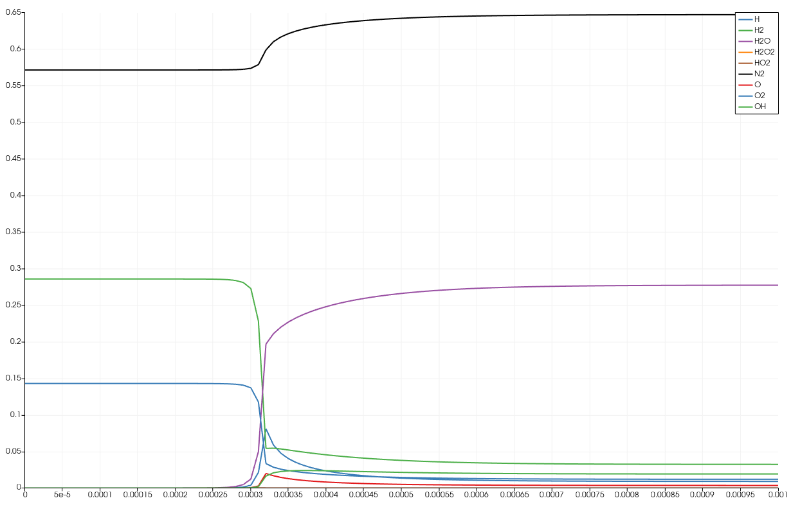

    
**********************
Examples
**********************

To compile and run a C++ example: ::

  cd FENGSim/toolkit/DAE/install/cantera_install/share/cantera/samples/cxx/kinetics1/
  mkdir build
  cd build
  cmake ..
  make
  ./kinetics1
  paraview kin1.csv

The figure below is generated using the "Plot Data" filter in ParaView, with the parameters for AR, density, pressure, temperature, and time excluded.

	   
