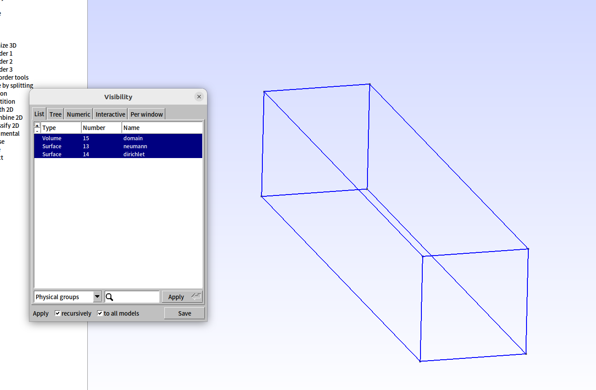
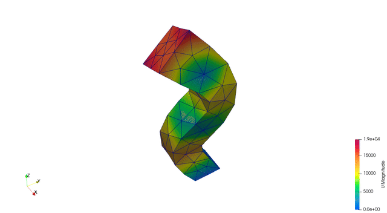
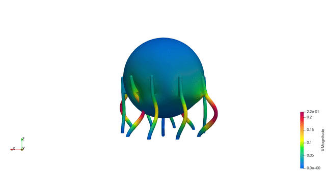

**********************
Pre/Post-Processing
**********************

Calculix uses the Abaqus ``.inp`` format for input files. The results are stored in ``.frd`` files which can be converted to ``.vtk`` format.

To convert ``.frd`` files to ``.vtk`` files: ::

  cd FENGSim/starter/ccx/Mesh1
  python3 ./../../../toolkit/MultiX/extern/Calculix/ccx2paraview/ccx2paraview.py modal.frd vtu
  python3 ./../../../toolkit/MultiX/extern/Calculix/ccx2paraview/ccx2paraview.py modal.frd vtk

For more details about the ``ccx2paraview`` converter, please refer to its ``README.md`` file.

=======================
Formats
=======================

-------------------------------------------
from .xml and .msh to .inp
-------------------------------------------

The ``xml2inp.py`` script converts ``configure.xml`` and a mesh file (``all.msh`` from CGX or ``all2.msh`` from GMSH) into a single ``modal2.inp`` file.
``xml2inp.py`` removes line and face elements from the ``.msh`` file.

To convert ``.xml`` and ``.msh`` to ``.inp``: ::
  
  cd FENGSim/starter/ccx/Mesh1
  python3 xml2inp.py 
  input .xml file: configure
  .xml file is configure.xml
  input .msh file: all2
  .msh file is all2.msh
  ./../../../toolkit/MultiX/extern/Calculix/bin/ccx_2.21 modal2
  python3 ./../../../toolkit/MultiX/extern/Calculix/ccx2paraview/ccx2paraview.py modal2.frd vtk

.. image:: fig/ccx_2.gif
   :height: 200px
   :alt: alternate text
   :align: center

-----------------------------------------------------------------
from .xml and .msh to .inp (with boundary conditions)
-----------------------------------------------------------------

GMSH automatically assigns unique IDs to all geometric sets. GMSH also defines physical groups for boundary conditions and materials, as shown in the figure below.

To create the model with physical groups by scripts: ::

  cd FENGSim/starter/ccx/beam
  gmsh beam

Since boundary conditions are defined on node sets, the option "Save groups of nodes" is choosed to export ``.inp`` files, as shown in the figure below.
   

To convert ``.xml`` and ``.msh`` to ``.inp``: ::
  
  cd FENGSim/starter/ccx/beam
  python3 xml2inp.py 
  input .xml file: configure
  .xml file is  configure.xml
  input .msh file: all
  .msh file is  all.msh
  ./../../../toolkit/MultiX/extern/Calculix/bin/ccx_2.21 modal
  python3 ./../../../toolkit/MultiX/extern/Calculix/ccx2paraview/ccx2paraview.py modal.frd vtk
  

--------------------------------------
from .xml and .dat to .inp
--------------------------------------

The ``dat2inp.py`` script converts ``configure.xml`` and ``oiltank.dat`` into a single ``modal.inp`` file.

To convert ``.xml`` and ``.dat`` to ``.inp``: ::
		
  cd FENGSim/starter/ccx/oiltank
  python3 dat2inp.py 
  input .xml file: configure
  .xml file is configure.xml
  input .dat file: oiltank
  .msh file is oiltank.dat
  ./../../../toolkit/MultiX/extern/Calculix/bin/ccx_2.21 modal
  python3 ./../../../toolkit/MultiX/extern/Calculix/ccx2paraview/ccx2paraview.py modal.frd vtk

The ``.dat`` file format is defined as follows:

- Line 1: The number ``31276`` represents the total number of vertices, and ``99818`` represents the total number of cells.
- Line 8: ``sphere_tank`` is the name of a cell group, and ``56644`` is the number of cells in this group.
- Line 12: ``outer_surface_nodes`` is the name of a vertex group, and ``9247`` is the number of vertices in this group.
- Other lines follow a similar pattern. 

::
  
  3 4 31276 99818
  1 -8315 2.55536e-12 0
  ......
  31276 8315 0 10850 
  1 59 2 1 98
  ......
  99818 31180 31223 31222 31179
  8 sphere_tank 56644
  2601
  .....
  97218
  7 outer_surface_nodes 9247
  788
  .....
  30489
  7 inner_surface_nodes 8317
  862
  .....
  30415
  7 fixed_nodes 200
  1
  .....
  31222
  8 guandao 2866
  47324
  .....
  52495
  8 support 40308
  1
  .....
  99818
  7 guandao_fixed_nodes 24
  14829
  .....
  16488

