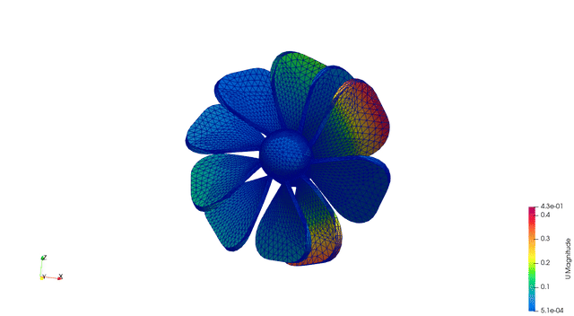
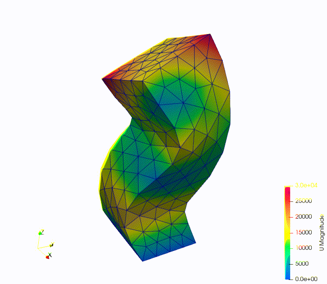

**********************
Pre/Post-Processing
**********************

Calculix uses the Abaqus ``.inp`` format for input files. The results are stored in ``.frd`` files which can be converted to ``.vtk`` format.

To convert ``.frd`` files to ``.vtk`` files: ::

  cd FENGSim/starter/ccx/Mesh1
  python3 ./../../../toolkit/MultiX/extern/Calculix/ccx2paraview/ccx2paraview.py modal.frd vtu
  python3 ./../../../toolkit/MultiX/extern/Calculix/ccx2paraview/ccx2paraview.py modal.frd vtk

For more details about the ``ccx2paraview`` converter, please refer to its ``README.md`` file.

=======================
Formats
=======================

-------------------------------------------
from .xml and .msh to .inp
-------------------------------------------

在 ``FENGSim/starter/ccx/Mesh1`` 目录下有configure_modal.xml、all.msh、all2.msh、modal.inp、xml2inp.py。
all.msh和all2.msh是inp格式的网格文件，虽然后缀名是.msh，all.msh是由cgx生成的Mesh1算例的原始网格文件，all2.msh是gmsh生成的新例子的网格文件。
xml2inp.py提取configure_modal.xml中的数据，提取all.msh或者all2.msh中的数据，生成新的modal2.inp。这里需要注意的是gmsh导出all2.msh的时候，
all2.msh中包括了边、面、体的单元数据，要把边和面的单元数据去掉，之后和configure_modal.xml中配置数据合并成一个modal2.inp。

xml2inp.py的运行结果如下图，文件名称不用输入后缀名。

.. image:: fig/ccx_2.png
   :scale: 50 %
   :alt: alternate text
   :align: center

运行以下命令。 ::
  
  cd FENGSim/starter/ccx/Mesh1
  mkdir Refs
  ./../../../toolkit/MultiX/extern/Calculix/bin/ccx_2.21 modal2
  python3 ./../../../toolkit/MultiX/extern/Calculix/ccx2paraview/ccx2paraview.py modal2.frd vtk

-----------------------------------------------------------------
from .xml and .msh to .inp (with boundary conditions)
-----------------------------------------------------------------

上面例子是没有边界位移约束情况下的，如果添加位移约束，首先要在Gmsh中定义边界组，如下图，这里需要注意的是，即使不定义边界组，Gmsh导出.inp格式文件也会自动给单元集合命名。

.. image:: fig/ccx/1.png
   :scale: 50 %
   :alt: alternate text
   :align: center

	   
其次需要注意的是在Gmsh导出all.msh的时候，选择Save groups of nodes，如下图，因为边界位移约束是定义在结点集合上，如果不选择会导出不了结点集合。
   
.. image:: fig/ccx/2.png
   :scale: 50 %
   :alt: alternate text
   :align: center

xml2inp.py的运行结果如下图，文件名称不用输入后缀名。
configure_modal.xml是.xml格式配置文件，all.msh是Gmsh生成的.inp格式文件，xml2inp.py脚本程序将configure_modal.xml中配置内容转换成.inp格式同时合并all.msh中的网格数据，
生成modal.inp文件给CalculiX使用。

.. image:: fig/ccx/3.png
   :scale: 50 %
   :alt: alternate text
   :align: center

运行以下命令。 ::
  
  cd FENGSim/starter/ccx/beam
  mkdir Refs
  ./../../../toolkit/MultiX/extern/Calculix/bin/ccx_2.21 modal
  ./../../../toolkit/MultiX/extern/Calculix/bin/cgx -b shapes.fbl
  python3 ./../../../toolkit/MultiX/extern/Calculix/ccx2paraview/ccx2paraview.py modal.frd vtk

--------------------------------------
from .xml and .dat to .inp
--------------------------------------

在 ``FENGSim/starter/ccx/oiltank`` 目录下有configure_modal.xml、oiltank.dat、dat2inp.py。
configure_modal.xml是配置文件，oiltank.dat是网格文件。
dat2inp.py提取configure_modal.xml文件中的数据，提取oiltank.dat文件中的数据，将.dat格式转成.inp格式，合并生成新的modal.inp。

dat2inp.py的运行结果如下图，文件名称不用输入后缀名。

.. image:: fig/ccx/oiltank.jpg
   :scale: 50 %
   :alt: alternate text
   :align: center

.dat文件格式很简单，如下第1行的31276为顶点个数，99818为单元个数，
第8行的sphere_tank为单元组名称，56644为单元个数，第12行outer_surface_nodes为顶点组名称，9247为顶点个数，其他类似。 ::
  
  3 4 31276 99818
  1 -8315 2.55536e-12 0
  ......
  31276 8315 0 10850 
  1 59 2 1 98
  ......
  99818 31180 31223 31222 31179
  8 sphere_tank 56644
  2601
  .....
  97218
  7 outer_surface_nodes 9247
  788
  .....
  30489
  7 inner_surface_nodes 8317
  862
  .....
  30415
  7 fixed_nodes 200
  1
  .....
  31222
  8 guandao 2866
  47324
  .....
  52495
  8 support 40308
  1
  .....
  99818
  7 guandao_fixed_nodes 24
  14829
  .....
  16488

运行以下命令。 ::
  
  cd FENGSim/starter/ccx/oiltank
  mkdir Refs
  ./../../../toolkit/MultiX/extern/Calculix/bin/ccx_2.21 modal
  ./../../../toolkit/MultiX/extern/Calculix/bin/cgx -b shapes.fbl
  python3 ./../../../toolkit/MultiX/extern/Calculix/ccx2paraview/ccx2paraview.py modal.frd vtk

.. image:: fig/ccx/oiltank.gif
   :scale: 50 %
   :alt: alternate text
   :align: center

