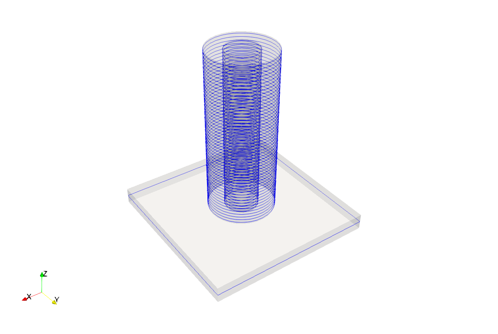
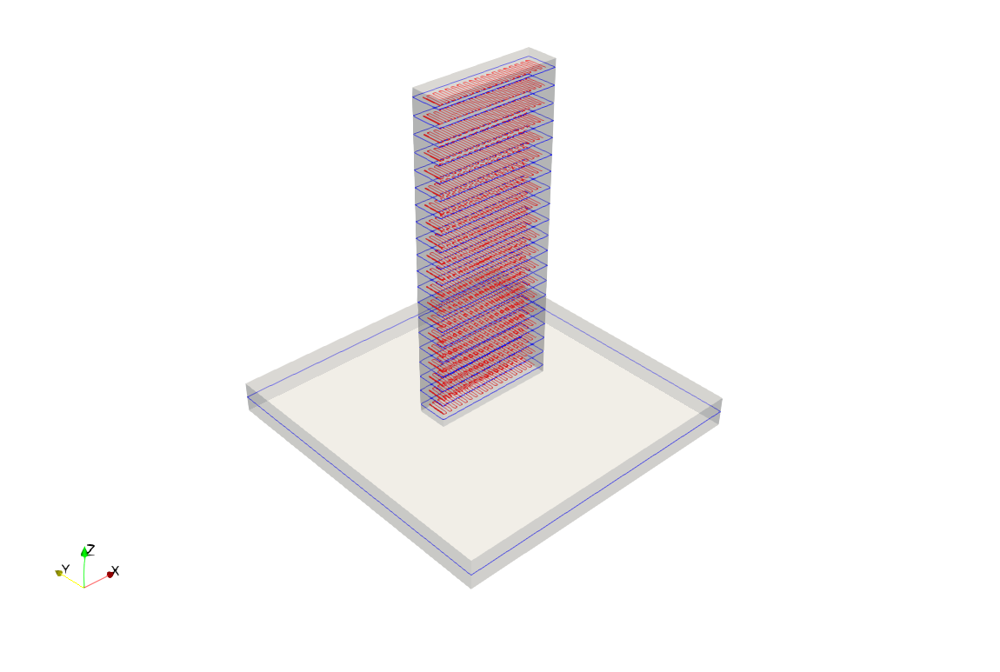

**********************
Examples
**********************

* Convert STL to slices: ::
		
    cd FENGSim/start/AM
    ./install
    cd build
    cmake ..
    make -j4
    ./multix

Open ``hole.stl`` (located in ``FENGSim/start/AM/build/AM/conf/geo/``) and ``slices.vtk`` (located in ``FENGSim/start/AM/build/data/vtk/``) using ParaView.

* Modify ``FENGSim/start/AM/build/AM/conf/m++conf`` to set ``loadconf = AM/conf/pathplanning.conf``. Do path planning: ::
		
    cd FENGSim/start/AM
    ./install
    cd build
    cmake ..
    make -j4
    ./multix

Open ``pathplanning.vtk`` (located in ``FENGSim/start/AM/build/data/vtk/``) using ParaView.

