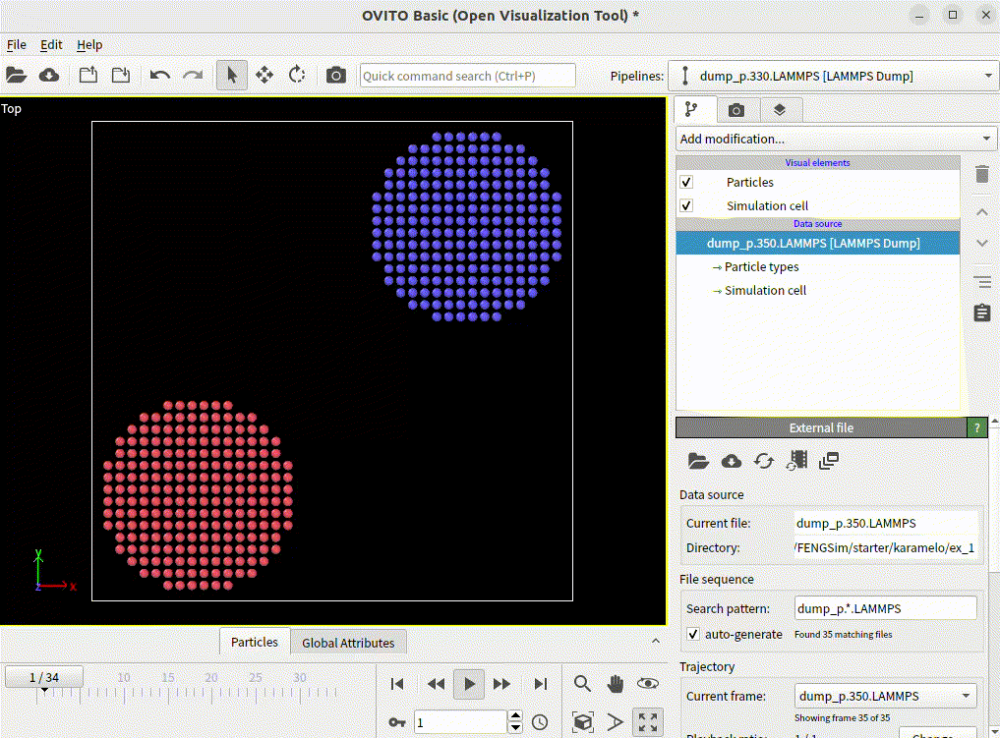

**********************
算例测试
**********************

在 ``FENGSim/starter/karamelo/ex_1`` 路径下保存了算例two-disks.mpm，按照如下命令操作执行。 ::

  cd FENGSim/starter/karamelo/ex_1
  ./../../../toolkit/MultiX/extern/Karamelo/build/karamelo -i two-disks.mpm

在 ``FENGSim/starter/karamelo/ex_1`` 路径下会产生dump_p.*.LAMMPS系列结果文件。
OVITO是一个专业的粒子仿真可视化软件，保存在 ``FENGSim/toolkit/MultiX/extern/Karamelo/ovito-basic-3.10.6-x86_64/bin/`` 路径下，按照如下命令操作执行，查看结果文件。 ::

  cd FENGSim/starter/karamelo/ex_1
  ./../../../toolkit/MultiX/extern/Karamelo/ovito-basic-3.10.6-x86_64/bin/ovito &

用OVITO打开dump_p.*.LAMMPS的文件，可以查看结果动画。

如果采用了并行计算，每个进程会单独生成结果文件，用Python脚本可以将所有进程文件合并起来，OVITO其实也具备这个功能，但是需要付费的专业版本。按照如下命令执行并行操作。 ::

  cd FENGSim/starter/karamelo/ex_1
  mpirun -np 2 ./../../../toolkit/MultiX/extern/Karamelo/build/karamelo -i two-disks.mpm

由于采用了２个进程并行，在 ``FENGSim/starter/karamelo/ex_1`` 路径下会产生dump_g.proc-0.*.LAMMPS和dump_g.proc-1.*.LAMMPS两个系列结果文件，按照如下命令执行合并操作。 ::

  cd FENGSim/starter/karamelo/ex_1
  python3 ../../../toolkit/MultiX/extern/Karamelo/ovito_merge_dumps.py

在 ``FENGSim/starter/karamelo/ex_1`` 路径下会产生dump.*.dump系列结果文件，可以用OVITO打开查看结果动画。
    
