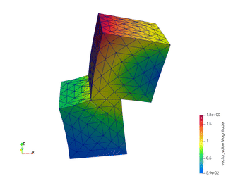
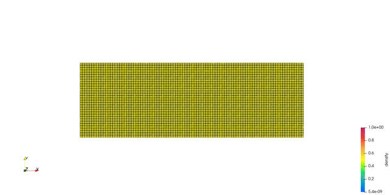

**********************
Examples
**********************

Multix has three couplers: one for large deformation, contact, and friction in fluid-solid/solid-solid problems; one for multiphase-multicomponent fluid; and one for assembly.

To run MultiX: ::

  cd FENGSim/toolkit/MultiX/build
  ./multix

========================
ALE
========================
.. image:: fig/ale.gif
   :alt: alternate text
   :align: center

========================
Assembly
========================

========================
EM
========================

To run the example: ::

  cd FENGSim/starter/multix/
  ./run
  paraview data/vtk/magnetostatics_nonlinear_domain.vtk

.. image:: fig/static_mag.png
   :scale: 50 %
   :alt: alternate text
   :align: center
	   
========================
Others
========================
We will re-implement the following MFEM topology optimization example using MultiX.

	   
