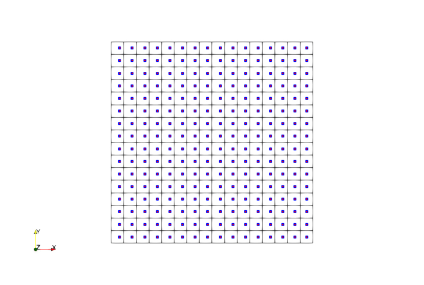
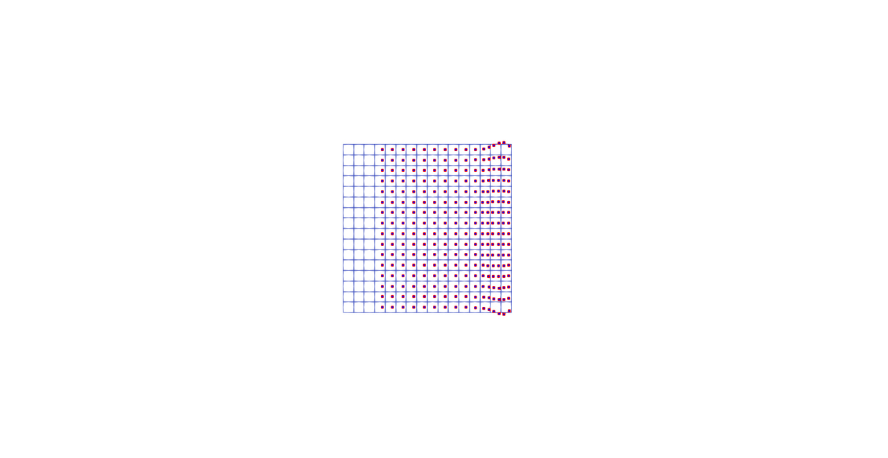
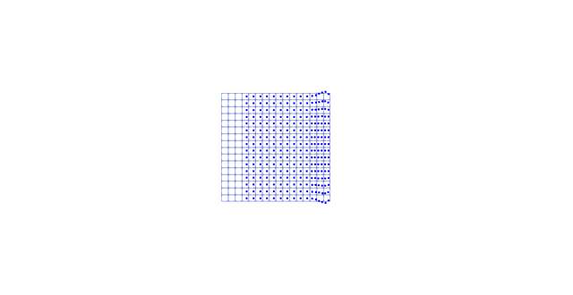
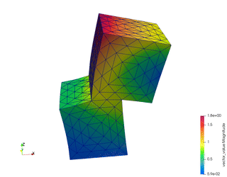
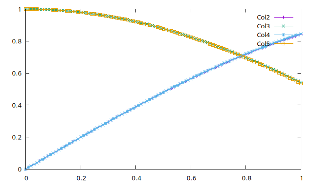
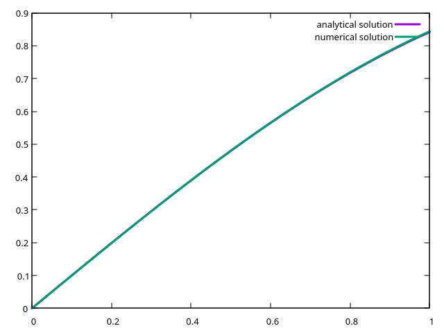
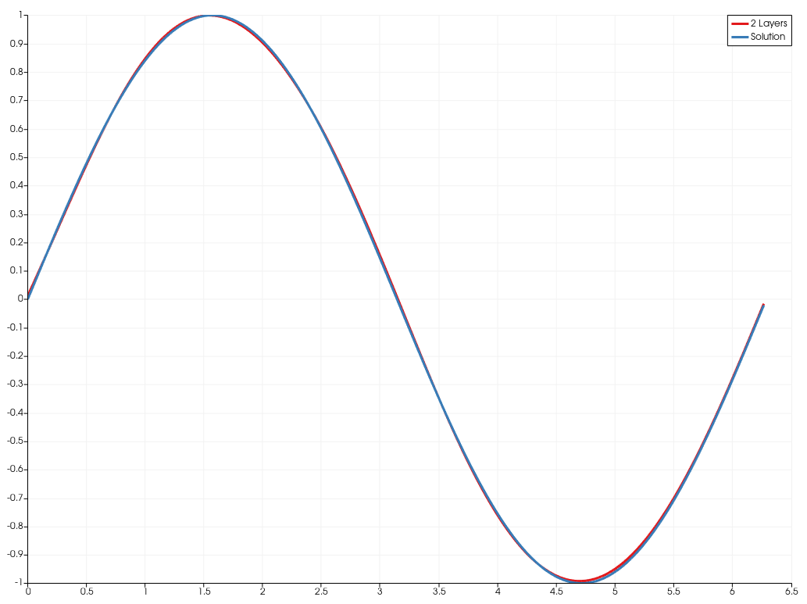
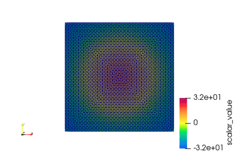
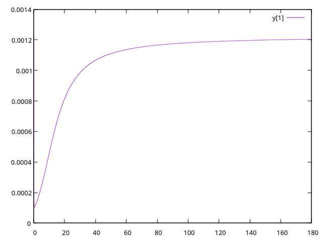
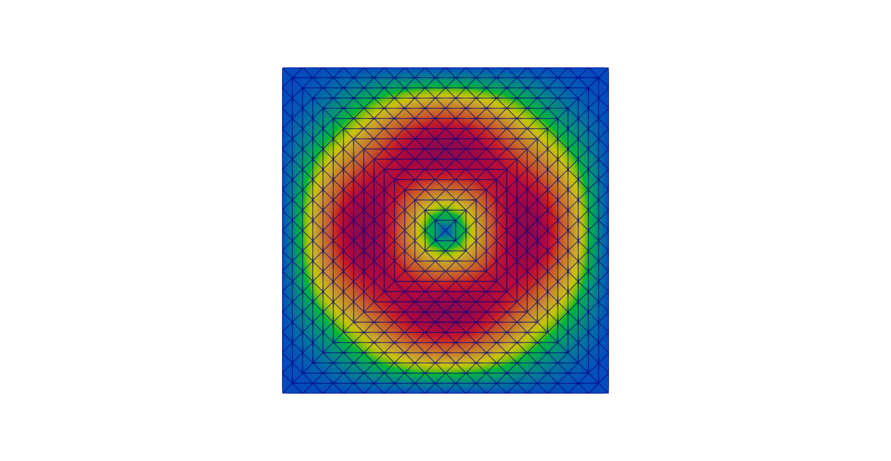

**********************
Examples
**********************

MultiX features three couplers: one for large deformation, contact, and fracture in fluid-solid and solid-solid problems; one for multiphase, multicomponent heat-fluid-solid interactions; and one for assembly.

To run MultiX: ::

  cd FENGSim/toolkit/MultiX/build
  ./multix

========================
Extreme Mechanics
========================

-------------------------
ALE
-------------------------

.. image:: fig/ale.gif
   :width: 100%
   :alt: alternate text
   :align: center

-------------------------
MPM
-------------------------

=============================
Complex Assembled Structure
=============================

------------------------------
Assembly and Modal Analysis
------------------------------

---------------------------------------------------------
Prestress Induced by Electrodynamic and Thermal Effects
---------------------------------------------------------

To run the example: ::

  cd FENGSim/starter/multix/
  ./run
  paraview data/vtk/magnetostatics_nonlinear_domain.vtk

.. image:: fig/static_mag.png
   :width: 100%
   :alt: alternate text
   :align: center

--------------------------
Mutibody
--------------------------

--------------------------
Reinforcement Learning
--------------------------

	   
==============================================================
Multi-Phase, Multi-Component Thermo-Hydro-Mechanical Systems
==============================================================

--------------------------
Multi-Phase
--------------------------

--------------------------
Multi-Component
--------------------------

--------------------------
Navier-Stokes equations
--------------------------

	   
======================================================================================================================================================
Multiscale Modeling of Multifunctional Material Properties
======================================================================================================================================================

--------------------------
Mechanical Performance
--------------------------

--------------------------
Electromagnetic Response
--------------------------

-----------------------------
Radiation Energy Deposition
-----------------------------
