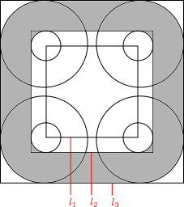

**********************
Pre/Post-Processing
**********************

``.xml`` and ``.conf`` files are configuration files, while ``.dat`` and ``.geo`` files are mesh data files.

To convert ``.geo`` to ``.dat`` ::

  cd FENGSim/starter/multix
  python3 dat2geo.py
  input .geo: example14
  .geo is Maxwell/conf/geo/example14.geo
  input .dat: example14
  .dat is example14.dat

To convert ``.dat`` to ``.geo`` ::
   
  cd FENGSim/starter/multix
  python3 dat2geo.py
  input .dat: example14
  .dat is example14.dat
  input .geo: example14
  .geo is Maxwell/conf/geo/example14.geo

=======================
Coil
=======================

在静磁模块的 ``FENGSim/starter/multix/Maxwell/conf`` 路径下的 ``configure.xml`` 配置文件中比较重要的是定义线圈中的电流。
在线圈Geom属性中定义了几何尺寸，例如下面xml代码中的Geom一行，一共四个数值。
其中第一个数值和第二个数值如图中的Geom[0]和Geom[1]，
第三个数值和第四个数值是线圈横截面的长宽。线圈平面局部坐标系的位置以及x轴和y轴方向定义如图中a，b，p。

.. code-block:: xml

      <part_5>
	<Attributes>5</Attributes>
      	<CurrentIntensity>3000</CurrentIntensity>
	<Geom>0.015,0.015,0.020,0.017</Geom>
	<Position>0,0,0</Position>
	<DirectionA>1,0,0</DirectionA>
	<DirectionB>0,0,1</DirectionB>
      </part_5>

	   
