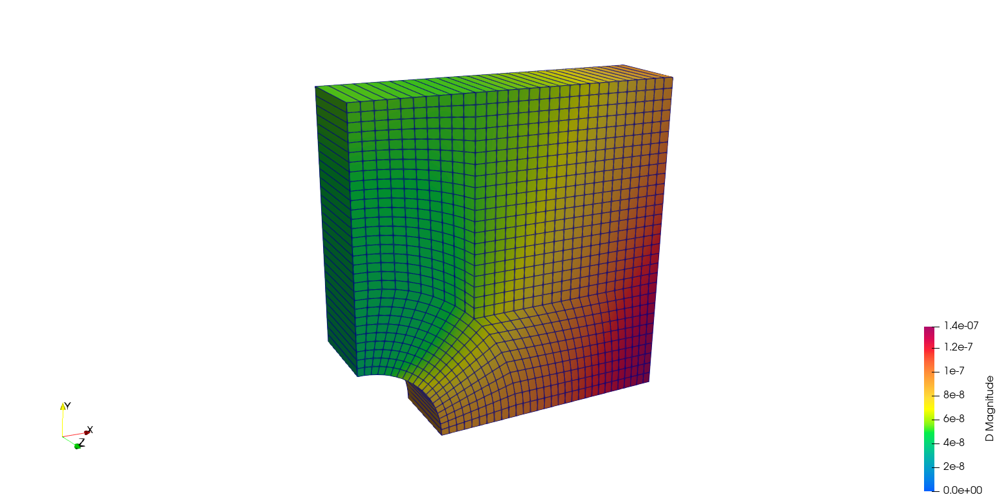
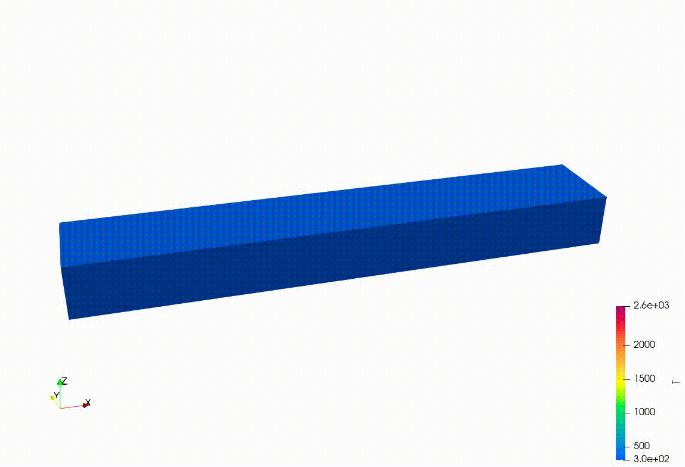
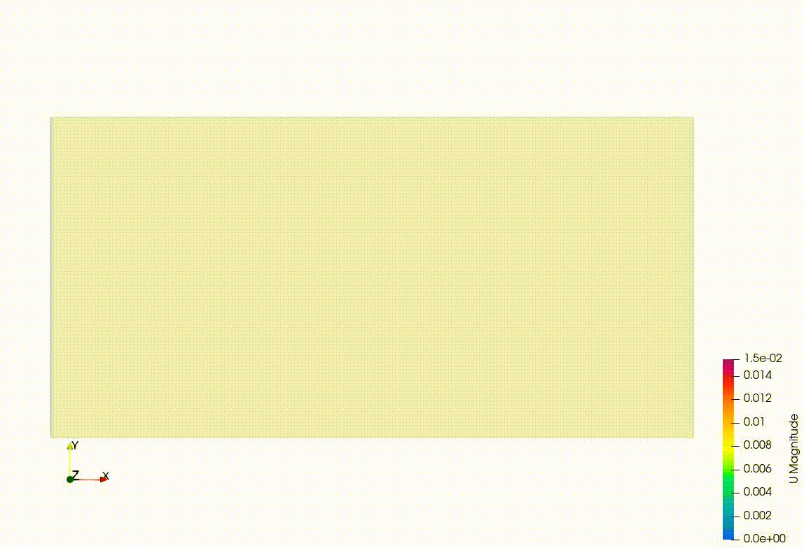

**********************
Examples
**********************

All modules listed in User Guide Section 3.5 (`<https://doc.cfd.direct/openfoam/user-guide-v13/solvers-modules>`_) are located in the directory ``FENGSim/toolkit/CFD/openfoam/OpenFOAM-dev/applications/modules``. These modules are compiled into libraries. For instance, the module ``modules/fluid`` is compiled into ``FENGSim/toolkit/CFD/openfoam/OpenFOAM-dev/platforms/linux64GccDPInt32Opt/lib/libfluid.so``.

All solvers listed in User Guide Section 3.6 (`<https://doc.cfd.direct/openfoam/user-guide-v13/standard-solvers>`_) are located in the directory ``FENGSim/toolkit/CFD/openfoam/OpenFOAM-dev/applications/solvers``. These solvers are compiled into binaries. For instance, the solver ``solvers/foamRun`` is compiled into ``FENGSim/toolkit/CFD/openfoam/OpenFOAM-dev/platforms/linux64GccDPInt32Opt/bin/foamRun``.

To run a solid example: ::
  
    cd FENGSim/starter/openfoam/platHole
    ./Allrun
    foamToVTK
    paraview VTK/VTK/plateHole_100.vtk
        

Melting pool in AdditiveFoam:
	   

	   

