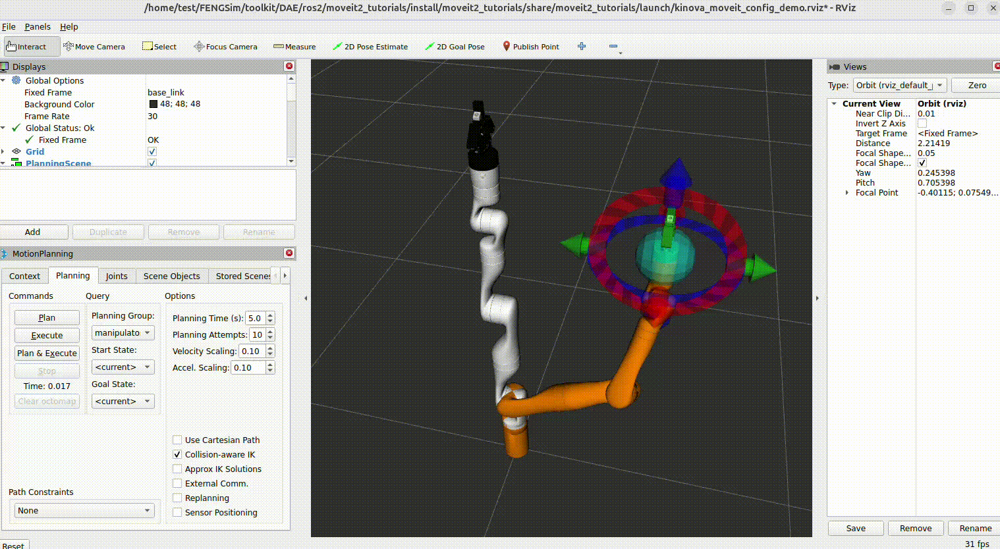

**********************
Examples
**********************

运行以下命令： ::

  cd FENGSim/toolkit/DAE/ros2
  source ros2/ros2_jazzy/install/setup.bash
  source moveit2/ws_moveit2/install/setup.bash
  source moveit2_tutorials/install/setup.bash
  ros2 launch moveit2_tutorials demo.launch.py

