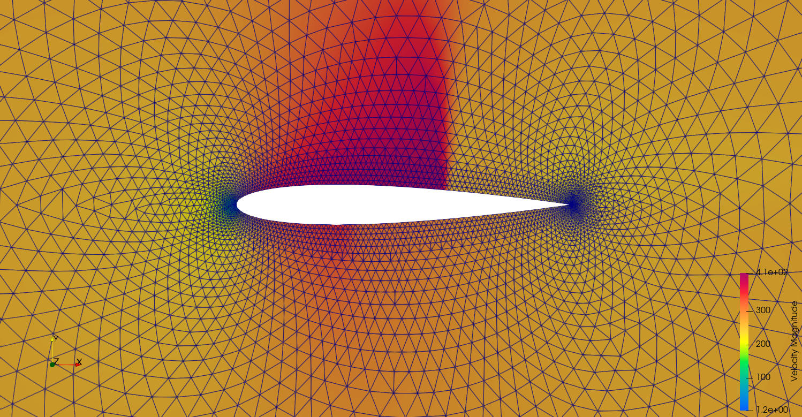

**********************
Examples
**********************

在 ``FENGSim/starter/su2/quickstart`` 目录中保存了网站Docs菜单中Quick Start的例子，该例子是Euler方程/可压/vertex-centered，运行如下命令。 ::
  
    cd FENGSim/starter/su2/quickstart
    mpirun -np 4 ./../../../toolkit/CFD/install/su2_install/bin/SU2_CFD inv_NACA0012.cfg

这里需要注意在Ubuntu24.04下必须按照并行运行，否则报错，但是Ubuntu22.04没有问题。
Ubuntu24.04下用apt安装的paraview打开 ``flow.vtu`` 报错，要用老一点版本的paraview，例如ParaView-5.11.2-MPI-Linux-Python3.9-x86_64。

SU2给了很多例子，在 ``FENGSim/toolkit/CFD/su2/TestCases`` 目录中，网格文件比较大，保存在另外一个仓库中 `<https://github.com/su2code/TestCases.git>`_ 。在网站Tutorials菜单中有这些例子的详细介绍。
	   
